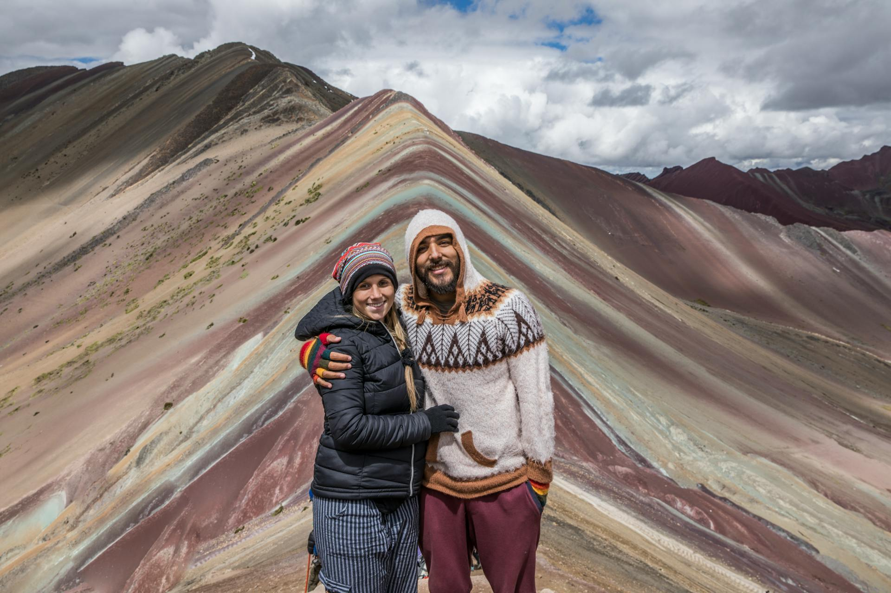

# 🏔️ Aventura Andina

Un sitio web moderno y responsivo para una empresa de turismo de aventura especializada en experiencias auténticas en los Andes. Construido con Next.js, TypeScript y Tailwind CSS.



## 🌟 Características Principales

- **Diseño Responsivo**: Optimizado para móvil, tablet y escritorio
- **Animaciones Suaves**: Efectos de scroll, hover y transiciones modernas
- **Navegación Inteligente**: Barra de navegación que cambia de estilo al hacer scroll
- **Contenido en Español**: Todo el contenido está en español latinoamericano natural
- **Imágenes Optimizadas**: Uso de Next.js Image para mejor rendimiento
- **Efectos Glassmorphism**: Elementos modernos con efectos de cristal
- **SEO Optimizado**: Metadatos y estructura semántica

## 🚀 Tecnologías Utilizadas

- **Framework**: Next.js 14 (App Router)
- **Lenguaje**: TypeScript
- **Estilos**: Tailwind CSS
- **Componentes UI**: shadcn/ui
- **Iconos**: Lucide React
- **Fuentes**: Inter (Google Fonts)

## 📁 Estructura del Proyecto

```
aventura-andina/
├── app/
│   ├── globals.css          # Estilos globales y animaciones
│   ├── layout.tsx           # Layout principal de la aplicación
│   └── page.tsx             # Página principal con todas las secciones
├── components/
│   └── ui/                  # Componentes UI de shadcn
├── public/
│   └── images/              # Imágenes del proyecto
└── README.md
```

## 🎨 Secciones del Sitio

### 1. **Hero Section**
- Imagen de fondo impactante de la Montaña de Colores
- Título principal y subtítulo descriptivo
- Botones de llamada a la acción
- Indicador de scroll animado

### 2. **Características**
- 4 tarjetas con servicios principales:
  - Rutas Exclusivas
  - Experiencias Culturales
  - Momentos Únicos
  - Conexión Auténtica
- Imágenes y descripciones para cada característica

### 3. **Nosotros**
- Historia de la empresa
- Estadísticas de logros
- Imagen principal con overlay de datos
- Lista de beneficios con checkmarks

### 4. **Precios**
- 3 planes de servicio: Básico, Pro, Empresa
- Plan "Pro" destacado como más popular
- Lista detallada de características incluidas
- Botones de reserva para cada plan

### 5. **Registro**
- Formulario de contacto con efecto glassmorphism
- Campos para nombre, email y teléfono
- Estadísticas de la empresa
- Fondo con gradiente colorido

### 6. **Footer**
- Enlaces organizados por categorías
- Información de contacto
- Iconos de redes sociales
- Copyright y políticas

## 🎨 Paleta de Colores

La paleta está inspirada en los colores naturales de la Montaña de Colores:

- **Naranja Principal**: `#f97316` (orange-500)
- **Rojo Acento**: `#ef4444` (red-500)
- **Amarillo Cálido**: `#eab308` (yellow-500)
- **Grises**: `#374151` (gray-700) para texto
- **Blanco**: `#ffffff` para fondos limpios

## ⚡ Instalación y Uso

### Prerrequisitos
- Node.js 18+ 
- npm o yarn

### Instalación

1. **Clonar el repositorio**
```bash
git clone https://github.com/tu-usuario/aventura-andina.git
cd aventura-andina
```

2. **Instalar dependencias**
```bash
npm install
# o
yarn install
```

3. **Ejecutar en desarrollo**
```bash
npm run dev
# o
yarn dev
```

4. **Abrir en el navegador**
Visita `http://localhost:3000` para ver el sitio.

### Comandos Disponibles

```bash
npm run dev          # Ejecutar en modo desarrollo
npm run build        # Construir para producción
npm run start        # Ejecutar versión de producción
npm run lint         # Ejecutar linter
```

## 📱 Responsividad

El sitio está optimizado para diferentes tamaños de pantalla:

- **Móvil**: < 768px
- **Tablet**: 768px - 1024px  
- **Desktop**: > 1024px

### Características Responsivas:
- Navegación móvil con menú hamburguesa
- Grid adaptativo en secciones de características y precios
- Imágenes que se ajustan automáticamente
- Tipografía escalable
- Espaciado optimizado para cada dispositivo

## 🎭 Animaciones

### Efectos Implementados:
- **Fade In Up**: Elementos aparecen desde abajo con fade
- **Hover Effects**: Transformaciones en tarjetas y botones
- **Scroll Animations**: Navegación que cambia al hacer scroll
- **Scale Effects**: Botones que crecen al hacer hover
- **Bounce**: Indicador de scroll animado

### CSS Personalizado:
```css
.animate-fade-in-up {
  animation: fadeInUp 0.8s ease-out forwards;
  opacity: 0;
  transform: translateY(30px);
}

.animation-delay-200 {
  animation-delay: 0.2s;
}
```

## 🖼️ Gestión de Imágenes

### Imágenes Incluidas:
- **Hero**: Montaña de Colores con pareja de viajeros
- **Características**: Imágenes de trekking, cultura, camping
- **Nosotros**: Experiencias culturales auténticas

### Optimización:
- Uso de Next.js Image para lazy loading
- Formatos WebP cuando es posible
- Tamaños responsivos automáticos
- Alt text descriptivo para accesibilidad

## 🌐 SEO y Accesibilidad

### SEO:
- Metadatos optimizados en español
- Estructura semántica HTML5
- URLs amigables
- Títulos jerárquicos apropiados

### Accesibilidad:
- Alt text en todas las imágenes
- Contraste de colores adecuado
- Navegación por teclado
- Etiquetas ARIA donde es necesario

## 🚀 Despliegue

### Vercel (Recomendado)
```bash
npm install -g vercel
vercel
```

### Netlify
```bash
npm run build
# Subir carpeta 'out' a Netlify
```

### Docker
```dockerfile
FROM node:18-alpine
WORKDIR /app
COPY package*.json ./
RUN npm install
COPY . .
RUN npm run build
EXPOSE 3000
CMD ["npm", "start"]
```

## 🔧 Personalización

### Cambiar Colores:
Edita las clases de Tailwind en `app/page.tsx`:
```tsx
// Cambiar color principal de naranja a azul
className="bg-orange-500" → className="bg-blue-500"
```

### Agregar Nuevas Secciones:
1. Crear componente en `app/page.tsx`
2. Agregar al return principal
3. Actualizar navegación si es necesario

### Modificar Contenido:
Todo el contenido está en español y se puede editar directamente en los componentes.

## 📄 Licencia

Este proyecto está bajo la Licencia MIT. Ver el archivo `LICENSE` para más detalles.

## 🤝 Contribuciones

Las contribuciones son bienvenidas. Por favor:

1. Fork el proyecto
2. Crea una rama para tu feature (`git checkout -b feature/AmazingFeature`)
3. Commit tus cambios (`git commit -m 'Add some AmazingFeature'`)
4. Push a la rama (`git push origin feature/AmazingFeature`)
5. Abre un Pull Request

## 📞 Contacto

**Aventura Andina**
- Email: info@aventuraandina.com
- Teléfono: +51 984 123 456
- Ubicación: Cusco, Perú

---

⭐ Si te gusta este proyecto, ¡dale una estrella en GitHub!
